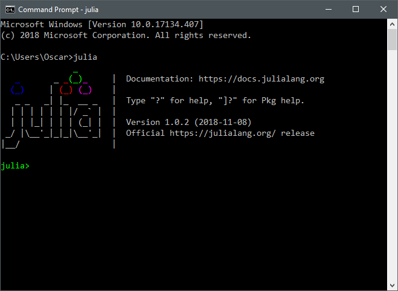

# Grid Science Winter School Julia Tutorial


This repository contains materials for the Julia/JuMP tutorial, held at the [Los Alamos National Laboratory
Grid Science Winter School, January 7-11, 2019](http://www.cvent.com/events/2019-grid-science-winter-school-conference/event-summary-58d3065a0e2947bb8750464ffab634ce.aspx).

This README will walk you through how to install Julia and IJulia.

### Install Julia

To get started, you first need to install Julia.

 - Download and install Julia v1.1 from [https://julialang.org/downloads/](https://julialang.org/downloads/).

**Windows 7 Users**: as instructed on the downloads page, you will need to
install at least version 3.0 of the [Windows Management Framework](https://docs.microsoft.com/en-us/powershell/wmf/overview).

### Download the materials

Next, you need to download a copy of these materials.

 - If you have `git`
installed, (after `cd`'ing to an appropriate directory) run
```
git clone https://github.com/lanl-ansi/tutorial-grid-science-2019
```
 - If you don't have `git` installed (i.e., the above command fails), [download this zip file](https://github.com/lanl-ansi/tutorial-grid-science-2019/archive/master.zip). Once downloaded, unzip it to an appropriate location.

### Open Julia

Now open Julia, either by typing `julia` at a terminal, or from where ever you installed it. Once open, you should be faced with the Julia *REPL* that looks like this:



### Install Jupyter

Now we need to install [Jupyter](http://jupyter.org/).
In the Julia REPL, run the following commands (this may take a little bit of time):
```julia
import Pkg
Pkg.add("IJulia")
```

### Open a Jupyter notebook

Okay, last step, let's launch a Jupyter notebook! Open a Julia REPL and then run:
```julia
using IJulia
IJulia.notebook(dir="/path/to/tutorial-grid-science-2019")
```

Note: we've had some reports that `dir="~"` fails on some NIX machines. Use an
absolute path instead.

If all goes well, a browser window will open that looks like this:


To get started on the content portion of the tutorials, click on the first notebook entitled `Class I - An introduction to Julia`.
