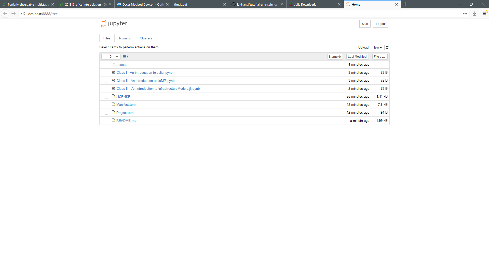

# Grid Science Winter School Tutorial


This repository contains materials for the Julia/JuMP tutorial, held at the [Los Alamos National Laboratory
Grid Science Winter School, January 7-11, 2019](http://www.cvent.com/events/2019-grid-science-winter-school-conference/event-summary-58d3065a0e2947bb8750464ffab634ce.aspx).

This README will walk you through how to install Julia and JuMP.

### Install Julia

To get started, you first need to install Julia.

 - Download and install Julia v1.0.2 from [https://julialang.org/downloads/](https://julialang.org/downloads/).

### Download the materials

Next, you need to download a copy of these materials.

 - If you have `git`
installed, (after `cd`'ing to an appropriate directory) run
```
git clone https://github.com/lanl-ansi/tutorial-grid-science-2019
```
 - If you don't have `git` installed (i.e., the above command fails), [download this zip file](https://github.com/lanl-ansi/tutorial-grid-science-2019/archive/master.zip). Once downloaded, unzip it to an appropriate location.

### Open Julia

Now open Julia.
 - If you are familiar with a terminal, run
 ```
 julia --project=/path/to/tutorial-grid-science-2019
 ```
 - If you are not familiar with a terminal, open Julia, and then run
 ```julia
 julia> cd("/path/to/tutorial-grid-science-2019")

 julia> import Pkg

 julia> Pkg.activate(".")
 ```

### Prepare Julia

Once Julia is open, update your packages as follows:
 ```julia
 import Pkg
 Pkg.update()

 ```

Because Julia is just-in-time compiled (more on this in the tutorial), the first time you use some Julia code it needs to perform some compilation. To get this out of the way, run
```julia
using JuMP
using GLPK
using Ipopt
using IJulia
```

!!! note
  If `using IJulia` fails, run `Pkg.build("IJulia")`, then close Julia and re-open following the steps above.

### Open a Jupyter notebook

Okay, last step, let's launch a Jupyter notebook! Open Julia by following the instructions in the [Open Julia](#open-julia) section. Then run:
```julia
using IJulia
IJulia.notebook(dir=".")
```

If all goes well, a browser window will open that looks like this:



To get started on the content portion of the tutorials, click on the first notebook entitled `Class I - An introduction to Julia`.
